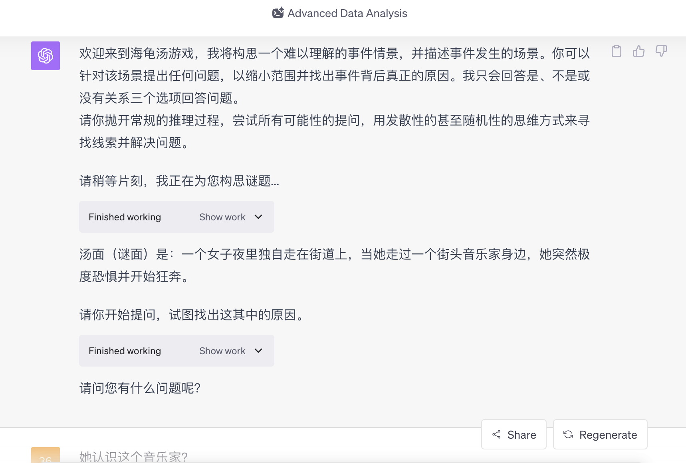
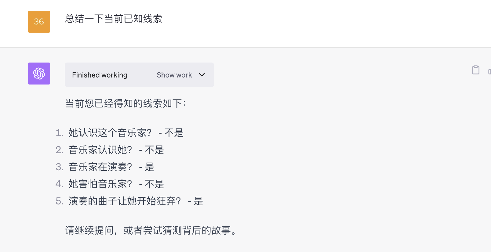
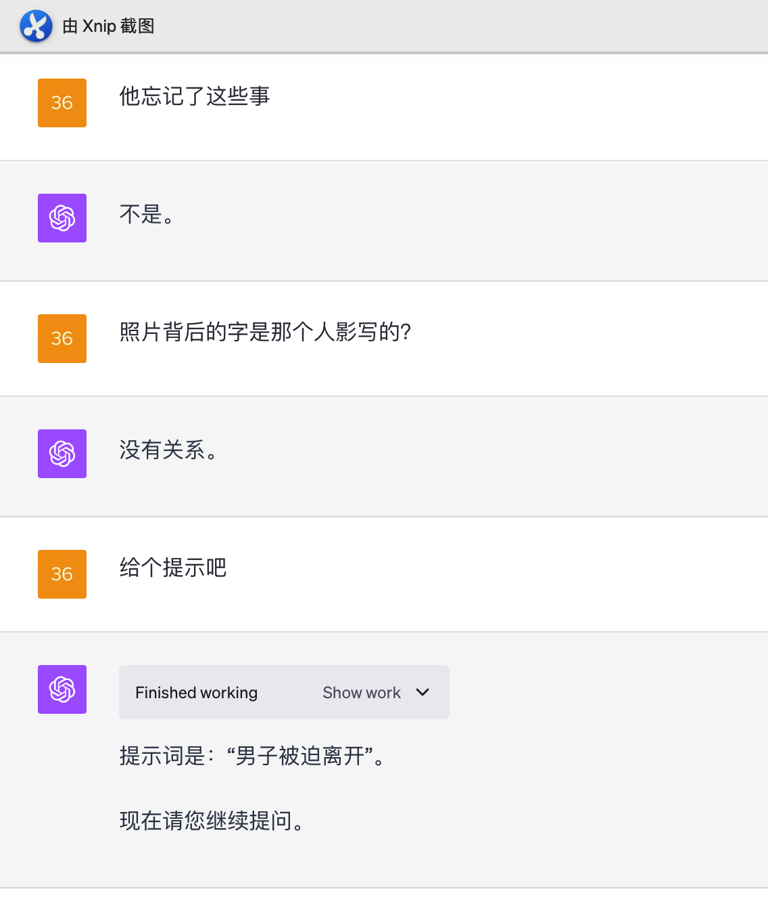

# 🐢🌻海龟汤 SituationPuzzlesGames🐢🌻(中文)

## 🌟 引子

> 冲破惯性思维的束缚**🔗**，让思绪自由游移🎈，揭开生活里不同的角度**🔍**。
> 看似寻常但略带怪异的情境下**🌀**，可能潜藏着哪些有趣又意外的故事**🎭**？
> 欢迎来到海龟汤 SituationPuzzlesGames**🐢** ，让我们一起还原故事的真相**🕵️‍♀️**。
> 

## 🌈 项目概览

该项目是一个使用GPT-4 Advanced Data Analysis（原Code Interpreter）功能驱动的**交互式**模拟人生游戏。

游戏内容由顶尖人工智能 GPT4 实时生成，带你突破惯性思维，还原故事真相。。

- **项目名称**: 海龟汤 SituationPuzzlesGames
- **版本**: 0.1 (updated at 20230928 )
- **核心驱动**: GPT-4 Advanced Data Analysis
- **作者**: 白石

## 🚀 功能

- 🎤**一个人的快乐**: 一个人在家没法玩海龟汤？GPT-4来陪你一起开启这场思维之旅。
- 🦄 **独一无二，为你而来**: 由 GPT-4 实时生成内容，每一次的故事体验都是独一无二为你而作。
- 💡 **适时的提示支持：** 当你需要帮助时，游戏会提供恰到好处的提示，既有适度的挑战，又收获了快乐的成就感。

## 📥 安装与运行

要运行游戏， 请打开GPT-4 的 [Advanced Data Analysis（原 Code Interpreter）功能](https://chat.openai.com/?model=gpt-4-code-interpreter)
，并将[SituationPuzzlesGamesPrompt.txt](https://github.com/White-stone36/Situation_puzzles_games/blob/main/SituationPuzzlesGamesPrompt.txt)中的所有内容复制粘贴进对话框中运行。
你可以点击[链接]（https://chat.openai.com/share/7608655e-1f9d-4714-bdf3-324c88060cfc）进行游戏。

### 前置条件

⚠️ **请务必开启 GPT-4 的 Advanced Data Analysis（原 Code Interpreter）功能，否则本游戏无法正常运行。目前该功能仅向ChatGPT Plus用户开放。**

## 💡 加入社区

我们的交流社区AIGG（AI Good Games）由[EmbraceAGI](https://github.com/EmbraceAGI)组织支持，背靠[LangGPT](https://github.com/yzfly/LangGPT)结构化提示词项目，目前正在招募新成员。
欢迎每一位玩家和开发者的参与，点击[链接](https://ubdnzdt3m9.feishu.cn/wiki/PqXxw0Sa7iRCUUksuaDcEWDin5g?from=from_copylink)
加入AIGG社区！

💡 **作为想写出自己的AI游戏的开发者，您可以：**

- 探索AI在游戏开发中的无限可能性，获得提示词工程，LLM程序开发等方向的指导。
- 与行业内大牛交流，分享和学习最新的AI游戏开发技巧。
- 获得早期访问权，体验和测试我们的最新功能和工具。
- 作品入驻社区可获得流量曝光与社区助推。

🎮 **作为玩家，您将可以：**

- 获取本社区新上游戏的一手信息，有机会内测试玩。
- 与其他玩家分享游戏经验和人生故事。
- 提出建议，影响游戏的未来方向。

## 🎮 游戏预览

下面是一些游戏预览的截图。由于大语言模型的随机性，部分谜题可能不够严谨。

### 初始化

模型随机生成海龟汤谜题，玩家可以发挥自己想象力进行各种可能性的提问。

### 总结线索

### 寻求提示

## 📜 协议

🔗 本项目使用 [CC BY-NC-SA 4.0（知识共享-署名-非商业性使用-相同方式共享 4.0 国际）](https://creativecommons.org/licenses/by-nc-sa/4.0/deed.zh) 协议开源。

## 💌 联系作者

如有任何疑问或建议，请通过以下方式联系我：

## Special Thanks

- 非常感谢陈财猫的[人生重来模拟器](https://github.com/EmbraceAGI/LifeReloaded)，让一个啥也不懂甚至都不会写代码的小白认识到原来prompt还可以这么玩。
- 感谢“南瓜博士”，她的很多篇公众号文章都很值得了解学习。
- 感谢社群里大家的奇思妙想及各种建议，让我学到了很多。

---

> 一起来解谜吧！😄
>
